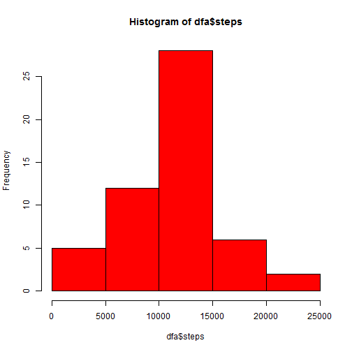

## Loading and preprocessing the data  


```r
if (!file.exists("data")) {
  dir.create("data")
} else {
  print("Folder data exists!")
}
```

```
## [1] "Folder data exists!"
```

```r
fileURL <- c("http://d396qusza40orc.cloudfront.net/repdata/data/activity.zip")
download.file(fileURL, destfile = ".\\data\\activity.zip")

zipFile <- c(".\\data\\dataset.zip")
unzip(zipFile, exdir = ".\\data")
ActFile <- c(".\\data\\activity.csv")
data1 <- read.csv(ActFile, header = TRUE, stringsAsFactors = FALSE)
```

## What is mean total number of steps taken per day?

```r
dfa <- aggregate(steps ~ date, data = data1, FUN = sum)
hist(dfa$steps, col = "red", main = "Total number of steps taken each day", xlab = "Steps")
```

 

```r
mean(dfa$steps)
```

```
## [1] 10766.19
```

```r
median(dfa$steps)
```

```
## [1] 10765
```

## What is the average daily activity pattern?

```r
dfa2 <- aggregate(steps ~ interval, data = data1, FUN = mean)
require(ggplot2)
```

```
## Loading required package: ggplot2
```

```r
ggplot(data = dfa2, aes(interval, steps)) + geom_line()
```

 

```r
dfa2[max(dfa2$steps), ]
```

```
##     interval    steps
## 206     1705 56.30189
```


## Are there differences in activity patterns between weekdays and weekends?

